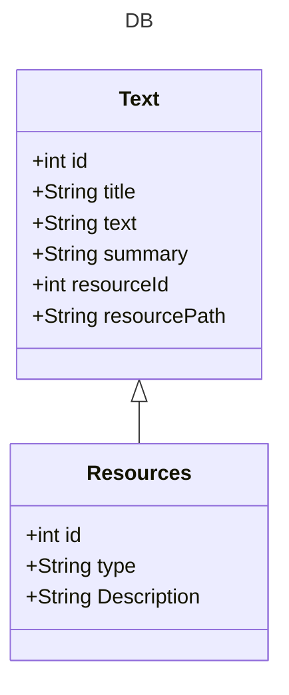

# Summary project

## Scheme 

```mermaid
---
title: DB

---
classDiagram
    Text <|-- Resources
    class Resources{
        +int id
        +String type
        +String Description
    }
    class Text{
        +int id
        +String title
        +String text
        +String summary
        +int resourceId
        +String resourcePath
    }
    
```